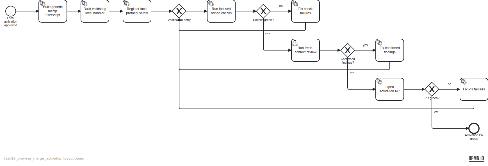

# Plan — Activate OpenWiki maintainer from browser merges

**Owning Task:** TASK-19 — Activate the OpenWiki maintainer from operator merges

## Intent

Deliver a local, event-driven bridge from the operator confirming a pull-request merge on GitHub to the dedicated OpenWiki maintainer Codex session for any qq-linked Repository. A generic Tampermonkey userscript reports only the canonical PR URL through the local `qq-openwiki://` scheme; the handler discovers and validates the Repository, independently verifies GitHub state, suppresses OpenWiki recursion and duplicate merge commits, and launches or wakes the maintainer through Herdr.

## Ownership boundary

This Change owns the generic GitHub userscript, local protocol handler, safe desktop registration, focused checks, and delivery to a green pull request. It does not maintain a Repository registry, poll GitHub, run a daemon or local server, install a self-hosted runner, change OpenWiki generation, or author wiki BPMN diagrams. TASK-6 remains the follow-on that teaches and acceptance-tests helpful BPMN generation.

The BPMN process ends at the activation pull request being green for handoff. Strict conformance and Task finalization are same-PR closeout metadata outside the diagram; operator merge, canonical installation, and the later TASK-6 live acceptance remain delivery or follow-on activity.

## Artifacts

- Plan specification: `assets/doc-28/plan-spec.json`
- Evidence-stamped BPMN: `assets/doc-28/plan.bpmn`
- Rendered approval diagram: `assets/doc-28/plan.png`
