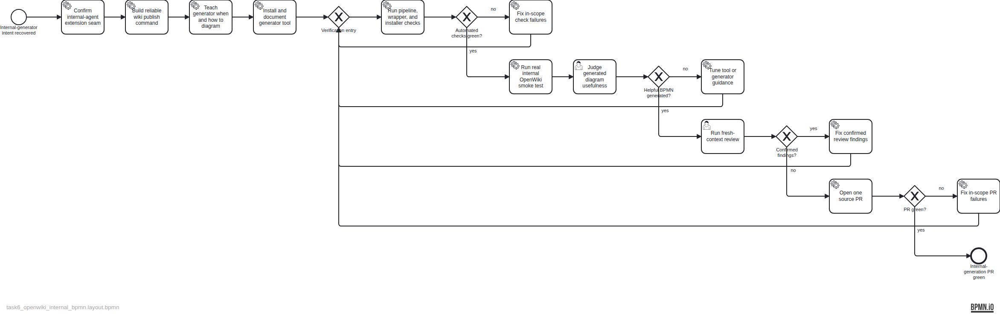

TASK-6 plan for teaching the OpenWiki internal generator to select and author helpful BPMN alongside Markdown. The dedicated outer maintainer remains the invoker, verifier, and delivery Actor; it is not the diagram author.

The deterministic source specification is `assets/doc-29/plan-spec.json`; the semantic BPMN is `assets/doc-29/plan.bpmn`.
