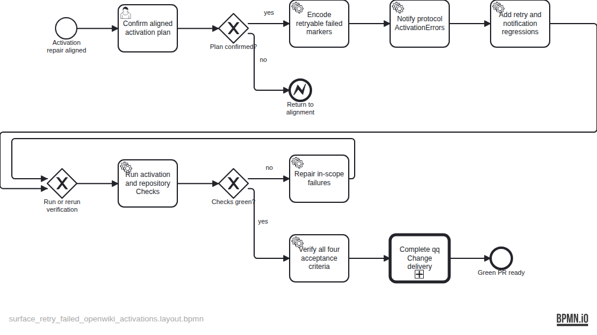

# Plan — Surface and retry failed OpenWiki merge activations

TASK-26 makes failed Herdr dispatch markers explicitly retryable on the next activation, preserves completed-dispatch dedupe, and surfaces every protocol-entry `ActivationError` through a Herdr desktop notification. Focused regression coverage observes both behaviors.

The evidence-stamped specification is at `backlog/docs/plans/assets/doc-35/plan-spec.json`; the semantic BPMN is at `backlog/docs/plans/assets/doc-35/plan.bpmn`.
